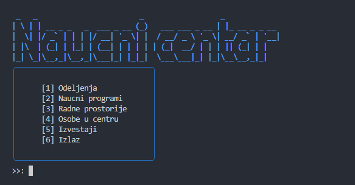

# Science Center Information System



This small project was done for course **Databases 2**. It runs a simple CLI application that allows to manage a database of a science center. Database used is PostgreSQL and it is run in a Docker container.

It required:

- Writting a specification based on the given requirements and domain
- Designing a EER diagram
- Translating the EER diagram to a relational model (Oracle Developer Data Modeler)
- Setting up a PostgreSQL database using Docker
- Executing DDL and DML scripts
- Implementing simple CLI application in Python that uses the database

## Requirements

- Python 3.10.12 or higher
- Docker 27.4.0 (Docker Compose 1.29.2)

## Setup

Create pyton venv in `cli` directory
```
cd cli
python3 -m venv venv
source venv/bin/activate
pip install -r requirements.txt
```

Setup the database using docker-compose
```
docker compose build
docker compose up -d
```

Run the CLI from project root directory
```
python3 cli/main.py
```